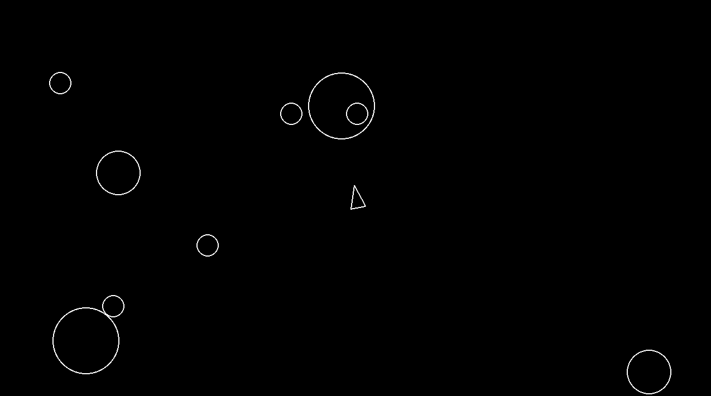

# Asteroids - Pygame Version 🚀

A Python implementation of the classic arcade game **Asteroids**, built using the `pygame` library. Navigate your spaceship through the asteroid field, destroy the rocks, and try to survive as long as possible!



## Features
- **Player Movement**: Smooth physics-based movement (acceleration and rotation).
- **Shooting**: Fire projectiles to destroy incoming asteroids.
- **Asteroid Mechanics**: Asteroids spawn randomly and float across the screen.
- **Collision Detection**: Precise hitboxes for ships, bullets, and asteroids.
- **Infinite Loop**: The asteroid field generates endlessly.

## Requirements
- Python 3.x
- Pygame

## Installation & Setup

1. **Clone the repository:**
   ```bash
   git clone [https://github.com/joaomartinscode/Asteroids-Pygame.git](https://github.com/joaomartinscode/Asteroids-Pygame.git)
   cd Asteroids-Pygame
